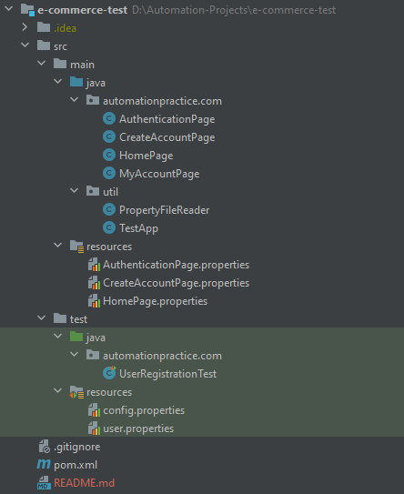

# Automation framework for Sample E-Commerce Website
>This project represent Page Object Model design pattern

### Introduction
This Project is for learn to automate different functionalities of an e-commerce website.

#### E-commerce website Url : http://automationpractice.com/index.php

#### Page Object Model (POM) :  
This is a design pattern, popularly used in test automation that creates Object Repository for web UI elements. The advantage of the model is that it reduces code duplication and improves test maintenance.

#### Automated functionalities in this project:

- Automate User Registration and Login
- Automate clicking the slide-over menus with Mouse hover command
- Automate scroll action using Mouse Events of Actions class
- Automate Search Product
- Automate end-to-end functionality of Buy Product

<!--
#### Testing Registration and Login of the Online Shopping Website

* Can a guest purchase product as guest user?
* Can a guest able to  register on the website easily?
* Once registered,  can a user able to login successfully?
* Can a registered user able to view all the products listed on the website?
* Are the user sessions being maintained for the intended time period?
* Is the user’s session timing out and expiring after defined time?
* Is registered user is able to view and modify it's user account information?
* Is registered user is not able to access user account after logout?

#### Testing Search feature of the Online Shopping Website

* Is website having multiple filters to search products like., price range, category, brands etc.?
* Are relevant Products are displaying after applying single or multiple search filters?
-->

### Maven
> Maven is project/build management tool.

Instead of downloading and placing the jars manually in the project, we can use maven to automate the process. We can define the dependency in the **pom.xml (Project object model)**. Maven requires internet to download the jars, which is a one time process.

### Dependencies

* [Selenium-Java](https://mvnrepository.com/artifact/org.seleniumhq.selenium/selenium-java) - is a free (open-source) automated testing framework used to validate web applications across different browsers and platforms.
* [TestNG](https://mvnrepository.com/artifact/org.testng/testng) -  is a testing framework inspired from JUnit and NUnit but introducing some new functionalities that make it more powerful and easier to use
* [WebdriverManager](https://mvnrepository.com/artifact/io.github.bonigarcia/webdrivermanager) - is an open-source Java library that carries out the management (i.e., download, setup, and maintenance) of the drivers required by Selenium WebDriver (e.g., chromedriver, geckodriver etc.) in a fully automated manner
* [Guava](https://mvnrepository.com/artifact/com.google.guava/guava) - is a set of core Java libraries from Google that includes new collection types (such as multimap and multiset), immutable collections, a graph library, and utilities for concurrency, I/O, hashing, caching, primitives, strings, and more!

### Author

name  : Ruwani Madumali

e-mail : ruwanimadumalids@gmail.com

[Github] (https://github.com/RuwaniMadumali)

### Folder Structure

### Contributing
Pull requests are welcome. For major changes, please open an issue first to discuss what you would like to change.

Please make sure to update tests as appropriate.

### License
This project is licensed under the MIT License - see the [LICENSE.txt](.LICENSE) file for details.